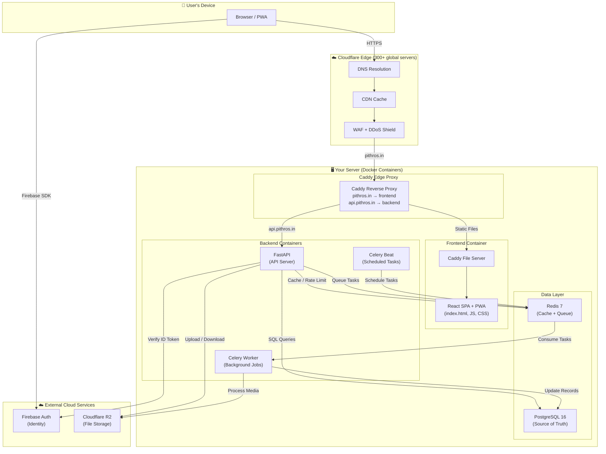
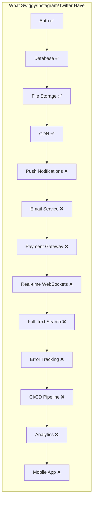

# 🏛️ Pithros — Complete Project Audit (ELI5)

> **What is Pithros?**  
> Think of it as a "digital graveyard + photo album + family tree" website. When someone passes away, their family creates a beautiful online memorial page — with photos, life story, timeline, tributes from friends, and even QR codes for physical gravestones. It's like if Instagram, a funeral home website, and a family history app had a baby.

---

## 📦 Part 1: Every Tool We Use & Why (ELI5)

Think of building a website like building a restaurant. You need a kitchen (backend), a dining room (frontend), a fridge (database), a filing cabinet (file storage), a waiter (web server), and a delivery van (deployment). Here's what each tool is:

---

### 🍳 THE KITCHEN (Backend — the brain that does the work)

| Tool | ELI5 Explanation | Why Pithros Uses It |
|:-----|:-----------------|:--------------------|
| **[FastAPI](file:///c:/Users/hp/Desktop/Pithros-Rememberence-Project/backend/app/main.py)** (Python) | The **chef** in the kitchen. When the website says "show me this memorial" or "upload this photo", FastAPI receives the order, cooks the response, and sends it back. It's like Express.js but for Python, and it's *extremely* fast. | Handles all API requests: creating memorials, uploading photos, managing users, processing tributes, verification workflows. Auto-generates API documentation at `/docs`. |
| **[Uvicorn](file:///c:/Users/hp/Desktop/Pithros-Rememberence-Project/backend/requirements.txt)** | The **kitchen door** — it's what actually listens for incoming orders and passes them to FastAPI. Without Uvicorn, FastAPI can't hear you knocking. | Runs the FastAPI app. In dev: `uvicorn app.main:app --reload`. In production: runs inside a Docker container. |
| **[Pydantic](file:///c:/Users/hp/Desktop/Pithros-Rememberence-Project/backend/app/core/config.py)** | The **food inspector** — checks that every order (request) has the right ingredients. If someone sends a name with 5000 characters or a negative age, Pydantic catches it *before* it reaches the database. | Validates all incoming data (memorial details, user profiles, upload requests). Also loads environment config safely via `pydantic-settings`. |
| **[SQLAlchemy](file:///c:/Users/hp/Desktop/Pithros-Rememberence-Project/backend/app/memorials/models.py)** | The **translator** between Python and the database. Instead of writing raw SQL like `SELECT * FROM memorials WHERE id = '123'`, you write Python code and SQLAlchemy translates it. | Defines all database tables (memorials, users, tributes, media, contributors) as Python classes. Handles relationships, queries, and transactions. |
| **[Alembic](file:///c:/Users/hp/Desktop/Pithros-Rememberence-Project/backend/alembic)** | The **renovation crew** for the database. When you add a new column (like "date_of_cremation"), Alembic writes a migration script that safely updates the database without losing existing data. Like Git, but for your database schema. | Manages database schema changes. `alembic upgrade head` applies all pending migrations. `alembic check` verifies models match the DB. |
| **[Celery](file:///c:/Users/hp/Desktop/Pithros-Rememberence-Project/backend/app/workers/celery_app.py)** | The **sous chef** who does slow tasks in the background. When you upload a 10MB photo, you don't want to wait 30 seconds staring at a spinner. Celery takes the photo, processes it in the background, and notifies you when it's done. | Generates image thumbnails, creates PDF memorial book exports, runs periodic cleanup/maintenance tasks. Uses Redis as its message queue. |
| **[Pillow](file:///c:/Users/hp/Desktop/Pithros-Rememberence-Project/backend/requirements.txt)** (PIL) | The **photo editor**. Resizes images, creates thumbnails, checks if a file is actually an image (not a virus disguised as a `.jpg`). | Processes uploaded memorial portraits, gallery photos, and verification documents. Content-sniffs files to reject fakes. |
| **[ReportLab](file:///c:/Users/hp/Desktop/Pithros-Rememberence-Project/backend/app/memorials/pdf_export.py)** | The **printing press**. Generates beautiful PDF documents from memorial data. | Creates archival PDF "memorial books" that families can download and print — a physical keepsake of the digital memorial. |
| **[qrcode](file:///c:/Users/hp/Desktop/Pithros-Rememberence-Project/backend/app/memorials/qr.py)** | The **QR code printer**. Generates scannable codes that link to memorial pages. | Families can print QR codes and attach them to gravestones, prayer rooms, or memorial cards. Scanning takes you directly to the online memorial. |
| **[boto3](file:///c:/Users/hp/Desktop/Pithros-Rememberence-Project/backend/app/media/storage.py)** | The **delivery truck** to cloud storage. It speaks the Amazon S3 language, which Cloudflare R2 also understands. | Uploads photos to Cloudflare R2, generates presigned URLs (temporary access links), and manages the three storage buckets (public, private, sensitive). |
| **[httpx](file:///c:/Users/hp/Desktop/Pithros-Rememberence-Project/backend/requirements.txt)** | The **phone** — makes HTTP calls to external services (like verifying Firebase tokens or calling payment gateways). | Communicates with Firebase Auth servers to verify user identity tokens. |

---

### 🍽️ THE DINING ROOM (Frontend — what users see and touch)

| Tool | ELI5 Explanation | Why Pithros Uses It |
|:-----|:-----------------|:--------------------|
| **[React 19](file:///c:/Users/hp/Desktop/Pithros-Rememberence-Project/Pithros/package.json)** | The **interior designer** of the restaurant. React builds the actual pages users see — buttons, forms, memorial cards, photo galleries. It's a library for building user interfaces, used by Instagram, Facebook, Netflix, Airbnb. | Every single page — landing, memorial creation, dashboard, admin panel, checkout — is a React component. |
| **[Vite 8](file:///c:/Users/hp/Desktop/Pithros-Rememberence-Project/Pithros/vite.config.ts)** | The **construction crew** that builds the restaurant. During development, Vite serves your code instantly with hot-reload (change code → see it immediately). For production, it bundles everything into optimized files. **Not Next.js** — Pithros is a Single Page App (SPA), not a server-rendered app. | Dev server on port 3000. Production build into `dist/` folder. Handles TypeScript compilation, CSS processing, code splitting. |
| **[TypeScript 7](file:///c:/Users/hp/Desktop/Pithros-Rememberence-Project/Pithros/package.json)** | The **grammar checker** for JavaScript. Normal JS lets you write `user.naem` (typo) and you only find out it's broken when a user complains. TypeScript catches it *before* you ship. | Every `.tsx` file is TypeScript. Catches bugs at compile time. `npx tsc --noEmit` verifies the entire codebase. |
| **[TailwindCSS 4](file:///c:/Users/hp/Desktop/Pithros-Rememberence-Project/Pithros/package.json)** | The **paint and wallpaper supplier**. Instead of writing CSS files, you write classes like `bg-blue-500 text-white p-4` directly on elements. | All styling across the app — dark/light themes, responsive layouts, hover effects, animations. |
| **[Motion](file:///c:/Users/hp/Desktop/Pithros-Rememberence-Project/Pithros/package.json)** (Framer Motion) | The **animator**. Makes things slide, fade, bounce, and transition smoothly. Without it, pages would just "pop" in and out like a PowerPoint from 2003. | Page transitions, modal animations, memorial card hover effects, loading skeletons. |
| **[Lucide React](file:///c:/Users/hp/Desktop/Pithros-Rememberence-Project/Pithros/package.json)** | The **icon library**. Provides hundreds of beautiful, consistent SVG icons (search, menu, heart, share, etc.). | Every icon in the UI — navigation, buttons, status indicators, social sharing. |
| **[Zod](file:///c:/Users/hp/Desktop/Pithros-Rememberence-Project/Pithros/package.json)** | The **bouncer at the door**. Validates form data on the client side *before* it even reaches the server. If you type an invalid email, Zod catches it instantly. | Form validation for memorial creation, user registration, tribute submission. |
| **[react-helmet-async](file:///c:/Users/hp/Desktop/Pithros-Rememberence-Project/Pithros/src/components/common/SEOHead.tsx)** | The **signboard painter**. Dynamically changes the `<title>`, meta descriptions, and Open Graph tags in the HTML `<head>` as you navigate. This is what Google and social media crawlers read. | Each page gets unique SEO meta tags. Memorial pages get the person's name in the title and their portrait as the OG image. |

---

### 🧊 THE FRIDGE & FILING CABINET (Databases & Storage)

| Tool | ELI5 Explanation | Why Pithros Uses It |
|:-----|:-----------------|:--------------------|
| **[PostgreSQL 16](file:///c:/Users/hp/Desktop/Pithros-Rememberence-Project/docker-compose.yml)** | The **main filing cabinet**. Stores ALL structured data: user accounts, memorial details, family relationships, tributes, verification records, payment history. It's the single source of truth. Think of it as a super-powered Excel spreadsheet that can handle millions of rows and never loses data. | Every table: `users`, `memorials`, `memorial_stewards`, `timeline_events`, `tributes`, `offerings`, `media_assets`, `verification_requests`, `audit_logs`. |
| **[Redis 7](file:///c:/Users/hp/Desktop/Pithros-Rememberence-Project/docker-compose.yml)** | The **sticky notes board**. Stores temporary, fast-access data. When 1000 people visit a popular memorial at the same time, Redis caches the result so PostgreSQL doesn't get overwhelmed. Also acts as the messenger between FastAPI and Celery. | **4 jobs**: (1) Caching frequently-accessed memorial data, (2) Rate limiting (preventing spam), (3) Celery message broker (task queue), (4) Idempotency keys (preventing duplicate payments). |
| **[Cloudflare R2](file:///c:/Users/hp/Desktop/Pithros-Rememberence-Project/backend/app/media/storage.py)** | The **cloud photo vault**. Stores heavy files: memorial portraits (5MB each), family gallery photos, audio memories, verification document scans, PDF book exports. | **3 buckets**: `pithros-public` (CDN-served portraits), `pithros-private` (family-only galleries, signed URLs), `pithros-sensitive` (verification documents, audit-logged access). **Zero egress fees** — viewing photos is free. |
| **[MinIO](file:///c:/Users/hp/Desktop/Pithros-Rememberence-Project/docker-compose.yml)** | The **fake Cloudflare R2 for your laptop**. During development, you don't want to upload real photos to the cloud every time you test. MinIO pretends to be R2 on your local machine. | Local development only. Same S3 API, same 3-bucket layout. Swapped for real R2 in production via a single env var (`STORAGE_BACKEND=s3`). |

---

### 🔐 THE SECURITY SYSTEM (Authentication & Identity)

| Tool | ELI5 Explanation | Why Pithros Uses It |
|:-----|:-----------------|:--------------------|
| **[Firebase Authentication](file:///c:/Users/hp/Desktop/Pithros-Rememberence-Project/backend/app/auth/firebase.py)** | The **ID card issuer**. Firebase handles the complex, dangerous parts of authentication: password hashing, email verification, Google/Phone sign-in, brute-force protection, session management. Pithros never sees or stores your password. | Users sign in via Firebase (Email, Google, Phone). Firebase gives them an **ID token** (a cryptographic proof of identity). The backend verifies this token on every request. |
| **[Firebase Client SDK](file:///c:/Users/hp/Desktop/Pithros-Rememberence-Project/Pithros/package.json)** (frontend) | The **sign-in form engine**. The React app uses this to show sign-in screens, handle Google OAuth popups, and manage the user's session in the browser. | `AuthContext.tsx` wraps the entire app. Every API call automatically attaches the Firebase ID token as a `Bearer` token in the `Authorization` header. |
| **[firebase-admin](file:///c:/Users/hp/Desktop/Pithros-Rememberence-Project/backend/requirements.txt)** (backend) | The **ID card verifier**. The backend uses this to verify that the ID token the frontend sends is real, not expired, and not forged. | `auth/firebase.py` decodes the JWT token, extracts the user's Firebase UID, and maps it to a Pithros user account. |

---

### 🚚 THE DELIVERY VAN & BUILDING (Deployment & Infrastructure)

| Tool | ELI5 Explanation | Why Pithros Uses It |
|:-----|:-----------------|:--------------------|
| **[Docker](file:///c:/Users/hp/Desktop/Pithros-Rememberence-Project/docker-compose.yml)** | The **shipping container**. Packages the entire app (code + dependencies + OS) into a standardized box that runs identically on any server. "Works on my machine" → "Works everywhere". | 6 containers: `postgres`, `redis`, `minio`, `backend` (FastAPI), `worker` (Celery), `frontend` (Caddy + built React app). |
| **[Caddy](file:///c:/Users/hp/Desktop/Pithros-Rememberence-Project/Caddyfile)** | The **receptionist + security guard**. Sits at the front door, greets visitors, sends them to the right room (frontend vs API), handles HTTPS certificates *automatically*, compresses responses, and adds security headers. | **Two Caddyfiles**: (1) [Root Caddyfile](file:///c:/Users/hp/Desktop/Pithros-Rememberence-Project/Caddyfile) — edge proxy routing `pithros.in` → frontend and `api.pithros.in` → backend. (2) [Frontend Caddyfile](file:///c:/Users/hp/Desktop/Pithros-Rememberence-Project/Pithros/Caddyfile) — serves the built React app with SPA routing, caching, compression. |
| **[Cloudflare](https://dash.cloudflare.com)** (DNS + CDN + WAF) | The **global delivery network + bodyguard**. Caches your website on 300+ servers worldwide so users in Mumbai, Delhi, and Chennai all get fast load times. Also blocks hackers, DDoS attacks, and bots. | DNS management, CDN caching, DDoS protection, Web Application Firewall (WAF), SSL/TLS termination. Sits in front of everything. |

---

## 🌐 Part 2: What Are PWA, SEO, robots.txt, sitemap.xml? (ELI5)

### PWA (Progressive Web App)
> **ELI5**: You know how you can "Add to Home Screen" on your phone and some websites behave like real apps? That's a PWA. It gets its own icon, opens without the browser address bar, and can even work offline.

| What We Added | What It Does |
|:---|:---|
| [**manifest.webmanifest**](file:///c:/Users/hp/Desktop/Pithros-Rememberence-Project/Pithros/vite.config.ts) | Tells the phone: "My name is Pithros, my icon is this golden diya, my theme color is dark navy, open me in standalone mode (no browser bar)." |
| **Service Worker (sw.js)** | A tiny invisible program that runs in the background. It caches fonts, images, and API responses so the app loads faster on repeat visits — and partially works even when offline. |
| **Workbox Caching Strategies** | Google Fonts → cached for 1 year. R2 media → cached for 30 days. API calls → try network first, fall back to cache. |
| **Icons (192x192, 512x512)** | Required by Android/iOS to show the app icon on the home screen. Like app icons in the Play Store. |

### SEO (Search Engine Optimization)
> **ELI5**: When someone Googles "memorial for Rajesh Kumar", you want Pithros to appear on the first page. SEO is all the tricks that make Google understand and rank your website.

| What We Added | What It Does |
|:---|:---|
| [**SEOHead.tsx**](file:///c:/Users/hp/Desktop/Pithros-Rememberence-Project/Pithros/src/components/common/SEOHead.tsx) | Dynamically changes the page title and description for every route. `/memorials` → "Explore Memorials — Pithros". `/m/rajesh-kumar` → "Rajesh Kumar — Memorial on Pithros". |
| **Open Graph (OG) Tags** | When someone shares a Pithros link on WhatsApp, Facebook, or Twitter, these tags control the preview card — the image, title, and description that appears. |
| **Twitter Cards** | Same as OG tags but specifically for Twitter/X. Shows a large image preview with the memorial person's portrait. |
| **JSON-LD Structured Data** | Hidden code that tells Google: "This is a WebSite called Pithros. This page is about a Person named Rajesh Kumar." Google uses this for rich search results (those fancy cards with photos). |
| **Canonical URLs** | Tells Google: "The official URL for this page is `https://pithros.com/memorials`, not `https://pithros.com/memorials?page=1&sort=latest`." Prevents duplicate content penalties. |

### robots.txt
> **ELI5**: A sign on your restaurant door that says "Delivery drivers welcome! But the kitchen and office are off-limits."

[**robots.txt**](file:///c:/Users/hp/Desktop/Pithros-Rememberence-Project/Pithros/public/robots.txt) tells Google's crawler:
- ✅ **Allowed**: `/`, `/memorials`, `/how-it-works`, `/farewell`, `/pricing` — index these!
- ❌ **Blocked**: `/dashboard`, `/admin`, `/partner`, `/account`, `/api`, `/checkout`, `/payment` — don't crawl these!

### sitemap.xml
> **ELI5**: A table of contents for Google. Instead of Google wandering around your site trying to find pages, you hand it a neat list: "Here are all 8 important pages, how often they change, and which ones matter most."

[**sitemap.xml**](file:///c:/Users/hp/Desktop/Pithros-Rememberence-Project/Pithros/public/sitemap.xml) lists every public URL with priorities (homepage = 1.0, memorials = 0.9, pricing = 0.6) and change frequencies (memorials = daily, pricing = monthly).

---

## 🏗️ Part 3: System Design (How Everything Connects)

### The Request Lifecycle (What Happens When You Open a Memorial Page)

1. **You type `pithros.com/m/rajesh-kumar`** in your browser
2. **Cloudflare DNS** resolves the domain to your server's IP address
3. **Cloudflare CDN** checks if it has a cached copy → if yes, serves it instantly from the nearest edge server
4. **Caddy Edge Proxy** receives the request, sees it's for `pithros.in`, forwards to the frontend container
5. **Caddy Frontend** tries to find a file at `/m/rajesh-kumar` → doesn't exist → falls back to `index.html` (SPA routing)
6. **React App** loads in your browser, reads the URL, renders the `PublicMemorialView` component
7. **React** calls `GET api.pithros.in/api/v1/memorials/public/rajesh-kumar`
8. **FastAPI** checks Redis cache first → cache miss → queries PostgreSQL
9. **PostgreSQL** returns the memorial data (name, dates, biography, timeline, tributes)
10. **FastAPI** caches the result in Redis (next visitor gets it in <1ms), returns JSON
11. **React** renders the beautiful memorial page with the data
12. **Portrait image** is loaded directly from Cloudflare R2 CDN (not through the API)

---

## 🔍 Part 4: What Pithros HAS vs What Big Apps Have

### ✅ What Pithros ALREADY Has

| Feature | Status | Where It Lives |
|:--------|:-------|:---------------|
| User Authentication (Email, Google, Phone) | ✅ Built | Firebase + `AuthContext.tsx` + `auth/` module |
| Memorial CRUD (Create, Read, Update, Delete) | ✅ Built | `memorials/` backend module, `CreateMemorialView.tsx` |
| Role-Based Access Control (Owner, Editor, Viewer) | ✅ Built | `memorials/permissions.py` — server-side enforcement |
| Privacy Levels (Public, Unlisted, Family, Private) | ✅ Built | Memorial model + permission checks |
| Timeline Events | ✅ Built | `timeline_events` table, memorial detail view |
| Tributes & Offerings | ✅ Built | `tributes/` module with moderation workflow |
| Photo/Media Upload Pipeline | ✅ Built | Presigned URLs → R2, content-sniffing validation |
| Image Thumbnail Generation | ✅ Built | Celery task in `media_tasks.py` |
| PDF Memorial Book Export | ✅ Built | `pdf_export.py` using ReportLab |
| QR Code Generation | ✅ Built | `qr.py` — for gravestones and memorial cards |
| Verification Workflow | ✅ Built | `verification/` module with evidence upload |
| Audit Logging | ✅ Built | `audit/` module — tracks who did what |
| Rate Limiting | ✅ Built | `rate_limit.py` — prevents spam/abuse |
| Idempotency Keys | ✅ Built | `idempotency.py` — prevents duplicate submissions |
| Dark/Light Theme | ✅ Built | `ThemeContext.tsx` with localStorage persistence |
| Multi-language Support (9 Indic languages) | ✅ Built | `LocaleContext.tsx` with Noto Sans/Serif font stacks |
| PWA (Installable App) | ✅ Built | `vite-plugin-pwa` + Workbox service worker |
| SEO (Meta tags, OG cards, JSON-LD, sitemap) | ✅ Built | `SEOHead.tsx` + `robots.txt` + `sitemap.xml` |
| Responsive Design (Mobile → Desktop) | ✅ Built | TailwindCSS breakpoints + safe-area insets |
| Search (Memorial Registry) | ✅ Built | `ExploreMemorialsView.tsx` + backend search |
| Farewell Network (Service Provider Directory) | ✅ Built (Frontend) | `FarewellNetworkView.tsx` |
| Pricing & Plans Page | ✅ Built (Frontend) | `PricingView.tsx` |
| Checkout & Payment UI | ✅ Built (Frontend) | `checkout/` views |
| Admin Panel UI | ✅ Built (Frontend) | `admin/` views |
| Partner Dashboard UI | ✅ Built (Frontend) | `partner/` views |
| API Documentation | ✅ Built | Auto-generated at `/docs` (Swagger UI) |
| Test Suite (40+ test cases) | ✅ Built | `backend/tests/` — authorization, media, search, etc. |
| Docker Compose (Dev + Prod) | ✅ Built | `docker-compose.yml` + `docker-compose.prod.yml` |
| Production-grade Web Server (Caddy) | ✅ Built | Both Caddyfiles with security headers, compression |
| Gzip + Zstandard Compression | ✅ Built | Caddy `encode gzip zstd` |
| Security Headers (HSTS, CSP, XSS, etc.) | ✅ Built | Caddy + `nginx.conf` (now removed) |
| Health & Readiness Endpoints | ✅ Built | `/health` + `/ready` (checks DB, Redis, Storage) |

---

### ❌ What's MISSING (What Swiggy / Twitter / Instagram / Facebook Have)

> [!IMPORTANT]
> These are features that **every serious production app** has. They're listed in order of priority — what you should build first is at the top.

#### 🔴 CRITICAL (Must-Have Before Launch)

| # | Feature | What It Is (ELI5) | Who Has It | Effort |
|:-:|:--------|:-------------------|:-----------|:-------|
| 1 | **Email Service (Transactional)** | When someone creates an account, resets a password, gets invited to a memorial, or a tribute is approved — they should get an email. Right now: **nothing is sent**. The invitation token is returned in the API response (a dev shortcut). | Every app ever. Gmail, Swiggy, Zomato, Twitter. | Medium. Use **Resend**, **AWS SES**, or **Postmark**. Create HTML email templates. |
| 2 | **Payment Gateway Integration** | The pricing page and checkout UI exist, but no actual money flows. You need Razorpay (India) or Stripe (global) integration to accept payments for premium memorial plans. Config keys exist in `config.py` but aren't wired. | Swiggy, Zomato, Netflix, Spotify. | Large. Razorpay SDK, webhook verification, invoice generation, refund handling. |
| 3 | **CI/CD Pipeline** | Right now, deploying means manually building and pushing. You need GitHub Actions (or similar) that automatically runs tests, builds Docker images, and deploys on every `git push`. | Every professional app. | Medium. GitHub Actions YAML, Docker registry, deployment script. |
| 4 | **Error Tracking & Monitoring** | When something crashes in production, you need to *know about it* immediately — not find out when a user complains on social media. | Every app. Swiggy uses Sentry. Instagram uses internal tools. | Small. Add **Sentry** (free tier: 5K errors/month). One line of code in frontend + backend. |
| 5 | **Database Backups** | If your PostgreSQL database dies, you lose *every memorial ever created*. You need automated daily backups to a separate location. The `backup` service exists in docker-compose but `scripts/backup.sh` needs to be wired. | Every app. This is not optional. | Small. `pg_dump` to R2 on a cron schedule. |
| 6 | **HTTPS / SSL Certificates** | Caddy handles this automatically in production, but you need to verify it's working with your domain `pithros.in`. Without HTTPS, browsers show "Not Secure" and Google penalizes your SEO ranking. | Every website since 2018. | Small. Caddy auto-generates Let's Encrypt certs. Just verify DNS. |

#### 🟡 IMPORTANT (Should Have Soon After Launch)

| # | Feature | What It Is (ELI5) | Who Has It |
|:-:|:--------|:-------------------|:-----------|
| 7 | **Push Notifications** | "Someone left a tribute on your father's memorial." Without this, users have to keep checking the app manually. Firebase Cloud Messaging (FCM) integrates with your existing PWA service worker. | Twitter, Instagram, Swiggy, WhatsApp. |
| 8 | **Real-time Updates (WebSockets)** | When 50 people are viewing a memorial during a prayer ceremony and someone posts a tribute, everyone should see it *instantly* without refreshing. Right now they'd have to reload. | Twitter (live feed), Facebook (reactions), WhatsApp (messages). |
| 9 | **In-App Notification Center** | A bell icon with a red badge showing unread counts: "3 new tributes", "Your verification was approved", "Family member joined". The API tags exist but the notification storage/delivery isn't wired. | Instagram, Facebook, LinkedIn, Swiggy. |
| 10 | **Full-Text Search (Elasticsearch/Meilisearch)** | Right now, search queries PostgreSQL with `ILIKE` (slow). For a memorial registry with 100K+ entries, you need a dedicated search engine that handles typos, fuzzy matching, and relevance scoring. | Google, Twitter, Swiggy (restaurant search), Amazon. |
| 11 | **Image CDN & Optimization** | Serve different image sizes based on the device. A phone gets a 400px portrait; a 4K monitor gets the full-res version. Saves bandwidth and speeds up loading by 50-70%. Use **Cloudflare Image Resizing** or **imgproxy**. | Instagram, Pinterest, Swiggy (food photos). |
| 12 | **Analytics Dashboard** | How many visitors today? Which memorials are most viewed? Where are users dropping off? You need **Google Analytics 4**, **Plausible** (privacy-friendly), or **PostHog** (self-hosted). | Every commercial website. |
| 13 | **Cookie Consent Banner** | Required by law in EU (GDPR) and increasingly in India. A banner that says "We use cookies for analytics. Accept / Reject." | Every website that operates internationally. |
| 14 | **Terms of Service & Privacy Policy Pages** | Legal documents explaining what data you collect, how you use it, and users' rights. Required before accepting payments. | Every commercial app. Non-negotiable for payment gateways. |
| 15 | **Rate Limiting on Frontend** | The backend has rate limiting, but the frontend should also debounce rapid clicks, prevent double-form-submission, and show "please wait" states. | Swiggy (order button), Twitter (tweet button). |

#### 🟢 NICE-TO-HAVE (What Makes You Stand Out)

| # | Feature | What It Is (ELI5) | Who Has It |
|:-:|:--------|:-------------------|:-----------|
| 16 | **Social Login (Apple, Microsoft, Facebook)** | Firebase supports these but they're not enabled yet. More sign-in options = fewer abandoned registrations. | Every modern app. |
| 17 | **Comment Replies & Threads** | Right now tributes are flat. Let people reply to specific tributes, creating conversations. | Facebook, Instagram, Reddit, YouTube. |
| 18 | **Reactions (Beyond Tributes)** | 🕯️ Light a candle, 🌹 Leave a rose, 🙏 Pay respects — quick emotional reactions without writing a full tribute. | Facebook (reactions), Instagram (❤️), Slack (emoji reactions). |
| 19 | **Content Moderation (AI)** | Automatically flag inappropriate tributes, spam, or offensive content before a family steward has to review it. Use OpenAI moderation API or Google Perspective API. | Instagram, Twitter, YouTube, Facebook. |
| 20 | **Accessibility (WCAG 2.1 AA)** | Screen reader support, keyboard navigation, color contrast ratios, focus indicators. ~15% of users have some form of disability. | Government requirement in many countries. Apple, Google prioritize this. |
| 21 | **Internationalization (i18n) for Content** | The UI supports 9 Indic languages, but the memorial *content* (tributes, biographies) could auto-detect language and apply the right font. | Facebook (auto-translate), Google Maps. |
| 22 | **Activity Feed / Timeline** | "Priya added a photo to Rajesh's memorial", "3 new tributes this week" — a chronological feed of everything happening across a user's memorials. | Facebook (News Feed), GitHub (activity), Strava. |
| 23 | **Export & Data Portability** | Let users download ALL their data (GDPR right). Memorial data as JSON, photos as ZIP, tributes as CSV. | Facebook, Google, Twitter (required by law). |
| 24 | **A/B Testing Framework** | Test two versions of the landing page to see which converts better. | Netflix, Swiggy, Airbnb, Amazon. |
| 25 | **Feature Flags** | Turn features on/off without deploying code. "Enable new tribute UI for 10% of users." Use **LaunchDarkly** or **Unleash**. | Every large app. |
| 26 | **API Versioning** | Currently `/api/v1/`. When you need breaking changes, you'd serve `/api/v2/` alongside v1 so old mobile app users don't break. | Twitter, Stripe, GitHub, every API company. |
| 27 | **Mobile App (React Native / Flutter)** | A real app on Play Store and App Store. The PWA is good, but a native app gets better push notifications, camera access, and offline support. | Instagram, Swiggy, Twitter, WhatsApp. |
| 28 | **Admin Analytics Panel** | Backend admin dashboard showing: total memorials, revenue, verification queue length, storage usage, top trending memorials. | Every SaaS product. |
| 29 | **Cron-Based Dynamic Sitemap** | The current `sitemap.xml` is static. It should auto-generate to include every public memorial page (`/m/rajesh-kumar`, `/m/sita-devi`, etc.) for Google to index them all. | Any content-heavy site. Wikipedia, Medium, news sites. |
| 30 | **Logging & Observability Stack** | Structured logs → **Loki** or **Elasticsearch**. Metrics → **Prometheus** + **Grafana**. Traces → **OpenTelemetry**. See exactly which API call is slow and why. | Every app at scale. Netflix, Uber, Swiggy. |

---

## 📊 Part 5: How Pithros Compares to the Big Apps

| Layer | Swiggy | Instagram | Twitter | Pithros |
|:------|:-------|:----------|:--------|:--------|
| **Frontend Framework** | React | React Native | React | React ✅ |
| **Backend Language** | Java/Go | Python/C++ | Java/Scala | Python (FastAPI) ✅ |
| **Database** | PostgreSQL + Cassandra | PostgreSQL + Cassandra | MySQL + Manhattan | PostgreSQL ✅ |
| **Cache** | Redis | Memcached + Redis | Redis | Redis ✅ |
| **File Storage** | S3 | S3 | S3 | Cloudflare R2 ✅ |
| **CDN** | CloudFront | Cloudflare | Akamai | Cloudflare ✅ |
| **Auth** | Custom + OTP | Facebook Login | Custom | Firebase ✅ |
| **Search** | Elasticsearch | Elasticsearch | Earlybird (custom) | PostgreSQL ILIKE ⚠️ |
| **Payments** | Razorpay + UPI | In-App Purchases | Stripe | ❌ Not wired |
| **Email** | SES + SendGrid | Custom | Custom | ❌ Not built |
| **Push Notifications** | FCM | APNs + FCM | Custom | ❌ Not built |
| **Real-time** | WebSocket | MQTT | WebSocket | ❌ Not built |
| **Monitoring** | Datadog | Custom | Custom | ❌ Not built |
| **CI/CD** | Jenkins | Custom | Custom | ❌ Not built |
| **Mobile App** | React Native | React Native | React Native | PWA only ⚠️ |

> [!TIP]
> **Bottom line**: Pithros has a **solid foundation** — the core architecture (FastAPI + React + PostgreSQL + Redis + R2 + Firebase + Caddy + Docker) is the same stack used by Y Combinator startups that raise millions. What's missing is the **operational layer** (emails, payments, monitoring, CI/CD) and **engagement layer** (notifications, real-time, social features). These are all incrementally addable without rewriting anything.

---

## 🗺️ Suggested Build Order (What to Do Next)

| Phase | What to Build | Why First |
|:------|:-------------|:----------|
| **Phase 1** 🔴 | Email (Resend/SES) + Payment (Razorpay) + Error Tracking (Sentry) | Can't launch without these |
| **Phase 2** 🔴 | CI/CD (GitHub Actions) + Database Backups + Domain/SSL setup | Can't deploy safely without these |
| **Phase 3** 🟡 | Push Notifications (FCM) + In-App Notifications + Analytics | User retention and engagement |
| **Phase 4** 🟡 | Full-Text Search (Meilisearch) + Image CDN + Dynamic Sitemap | Performance and SEO at scale |
| **Phase 5** 🟢 | Social features (replies, reactions) + AI moderation + A11y audit | Stand out from competitors |
| **Phase 6** 🟢 | Mobile app (React Native) + Observability stack + Feature flags | Scale and iterate fast |
